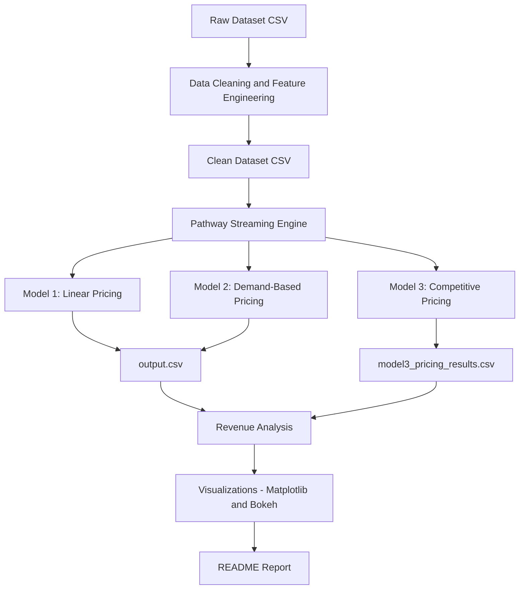

# capstone_project_sa
#  Dynamic Pricing for Urban Parking Lots

A real-time dynamic pricing engine for urban parking lots that uses machine learning and stream processing to optimize revenue. This project implements three pricing models — Linear, Demand-Based, and Competitive — using real-time data inputs like occupancy, traffic, and vehicle type.

---

##  Tech Stack

| Category         | Tools Used                           |
|------------------|--------------------------------------|
| Language         | Python 3                              |
| Data Handling    | Pandas, NumPy                         |
| Real-Time Engine | [Pathway](https://pathway.com)        |
| Visualization    | Matplotlib, Bokeh                     |
| Deployment (opt) | Jupyter Notebook / Colab              |
| Data Format      | CSV (cleaned and streamed)            |

---

##  System Architecture

---

##  Project Workflow

### 1.  Data Cleaning
- Combined date and time into a timestamp field
- Encoded:
  - `VehicleType` → numeric weight
  - `TrafficConditionNearby` → {Low: 2, Average: 5, High: 8}
- Final cleaned dataset saved as: `clean_dataset_final.csv`

---

### 2.  Pricing Models

####  Model 1: Linear Pricing
> `price = base_price + α × (occupancy / capacity)`

- Fast and easy to interpret
- Reacts directly to how full a lot is

####  Model 2: Demand-Based Pricing
> `price = base × (1 + 1.5 × normalized_demand)`

- Combines:
  - Occupancy
  - Queue length
  - Traffic level
  - Vehicle type
  - Special day flag

####  Model 3: Competitive Pricing
- Based on **Model 2**, but adds:
  - Neighbor lot prices within **2 km**
  - Rerouting logic:
    - If current lot is full and cheaper options exist → reduce price
    - If neighbors are more expensive → increase price

---

### 3.  Real-Time Streaming with Pathway

- Simulated a real-time data pipeline using `pathway.io.csv.read()` in streaming mode
- Each new row was priced using all 3 models on-the-fly
- Output streamed to: `output.csv`

---

##  Revenue Evaluation

Revenue per model was calculated as:  
`revenue = price × occupancy`

| Model     | Avg Revenue |
|-----------|-------------|
| Model 1   | ₹8141.92    |
| Model 2   | ₹7555.18    |
| Model 3   | ₹7737.10    |

 **Model 1 had highest revenue**, but  
 **Model 3 provides a balance between fairness, demand, and competitive response.**

---

##  Visualizations

###  Revenue Comparison

Bar chart showing average revenue across models:

###  Dynamic Pricing Over Time (Bokeh)

Interactive Bokeh line chart for a selected parking lot:

##  Future Work

- Incorporate **real-time traffic APIs**
- Add **weather and event data**
- Deploy as a **Streamlit dashboard**
- Apply **reinforcement learning** for price optimization

---

##  Author

**Tejas Teju**  
 Data Science & Machine Learning Enthusiast  
 Email: [teju6342@gmail.com]

---

> “Smart cities begin with smarter parking — driven by dynamic pricing intelligence.”

